# SpenDrop

A self-hosted household expense tracker built for families who want full control over their financial data. Track transactions, set budgets, monitor spending trends, and manage multiple users -- all from a single Docker container running on your own hardware.

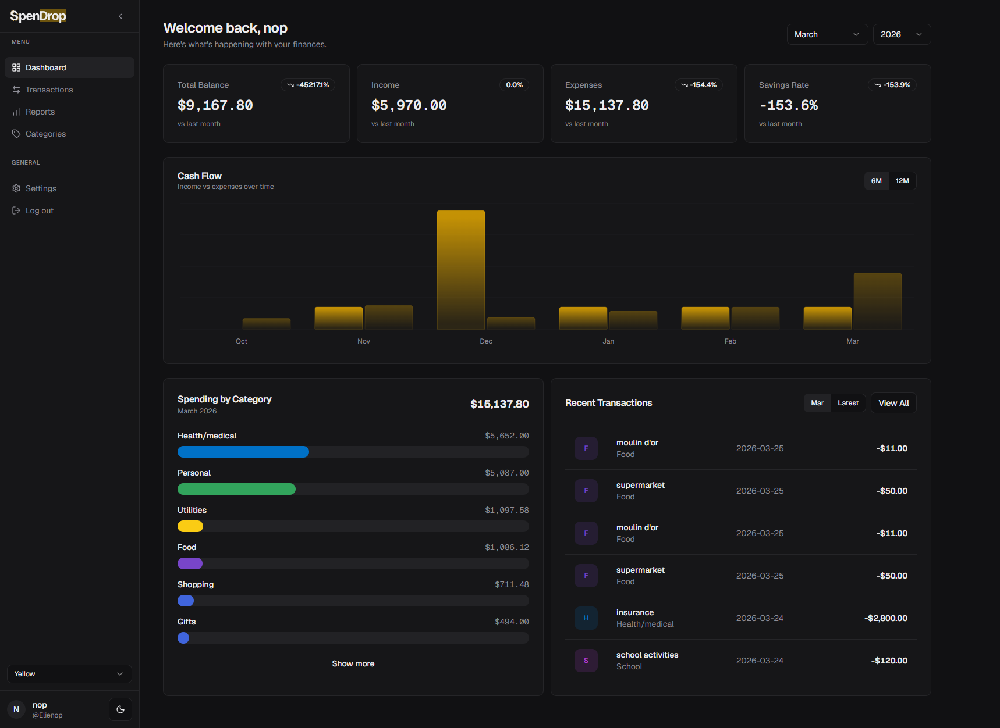

## Why SpenDrop?

Most budgeting apps require cloud accounts, charge subscriptions, or mine your financial data. SpenDrop is different:

- **Self-hosted** -- your data stays on your server, always
- **No subscriptions** -- deploy once, use forever
- **Household-ready** -- admin and member roles for shared family tracking
- **Excel-native workflow** -- import your existing spreadsheets, export back to Excel anytime
- **Fast data entry** -- spreadsheet-like keyboard flow (Enter to save, auto-focus next row)

## Features

### Dashboard

Real-time financial overview with KPI cards (total balance, income, expenses, savings rate), a 6/12-month cash flow chart, spending breakdown by category, and recent transactions -- all filterable by month and year.


### Transaction Management

Full CRUD for transactions with sortable columns (date, description, category, amount), search with find-and-replace, bulk selection with batch delete and bulk edit, inline editing, category badges, tag support, and pagination. Export to Excel at any time.

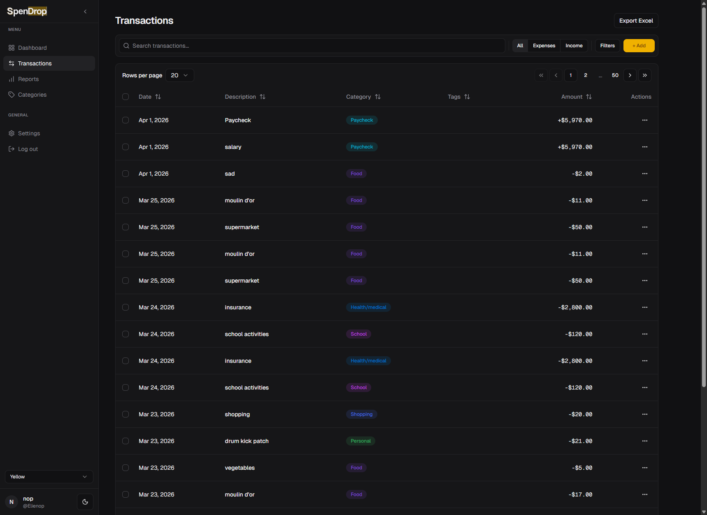

### Bulk-edit

Select multiple transactions (via checkboxes or the "Select all N matching" banner) and click **Edit (N)** in the selection action bar. The dialog lets you change Date, Description, Category, or Tags across every selected row in one round-trip.

- Each field defaults to "no change". Only fields you explicitly modify are sent to the server.
- Tags support **Add**, **Remove**, and **Replace** modes via a radio group above the tag input. Tag matching is byte-for-byte case-sensitive (e.g. `Tax` and `tax` are different).
- **Page mode** (visible-page IDs only) fires immediately. **All-matching mode** (everything matching the current filter) opens a confirmation step listing the changes before submitting.
- Selection is pruned after submit: rows that the edit kicks off the current filter naturally drop out of the selection. A toast tells you when this happens.
- **Ownership:** the transactions list is household-wide, so a selection routinely spans several members' rows. **Admins can bulk-edit any household row**; members can only edit rows they created. This matches bulk delete, bulk rename, and single-row edit (which returns a 403 rather than skipping). Deleted (tombstoned) rows are always skipped, for every role.
  - In **page mode**, rows a member can't edit are counted in the toast as skipped ("Updated 3 transactions, skipped 2").
  - In **all-matching mode**, a member's filter is scoped to their own rows in SQL, so other members' rows are never matched in the first place and there is no skipped count to report — the toast shows only what was updated.

API endpoints:
- `POST /api/transactions/batch-update` — body `{ ids, patch, tagsMode? }`
- `POST /api/transactions/update-by-filter?<querystring>` — body `{ patch, tagsMode? }`

### Multi-currency transactions

The transaction entry row has an inline currency selector. Pick a currency other than your household base (configured in Settings -> Currencies) to record the original-currency amount; SpenDrop divides by the configured `rate_to_base` and stores the base-currency value as the authoritative ledger amount. The list view shows both: the canonical base amount on top, and the original-currency amount as a muted secondary line.

Caveats:

- Every non-base currency must have a configured `rate_to_base` in Settings. If the rate is missing or zero, Save is blocked.
- The `~=` preview shown while typing is frontend-approximate; the persisted value is the backend's recomputed amount (they round identically so they agree to the cent).
- Inactive currencies don't appear in the entry-row picker but remain selectable on edit so historical rows round-trip.

### Mobile capture (installable PWA)

SpenDrop installs to your phone's home screen as a PWA (web manifest + service worker) and opens straight into a focused **Quick Add** screen at `/quick`, built for logging a transaction as fast as typing it into a chat. An **Expense | Income** toggle at the top switches the category set (defaulting to Expense, the common case) so a paycheck is as quick to log as a coffee -- income previews and lands with a green `+`. Two modes share one entry pipeline:

- **Freeform** -- type a single line like `lunch 12.50 #work`; SpenDrop parses the amount, currency, `#tags`, and description, and auto-selects the matching category for the active type (you confirm it or tap another). It never guesses a category from a non-match -- you pick one with a tap.
- **Tap** -- a large amount field plus one-tap category chips for thumb-only entry.

Each save shows an **Undo** toast, remembers your last category/currency for the next entry, and refocuses for rapid logging -- reusing the same multi-currency conversion and validation as the desktop entry row. Reach it from the **Quick add** item in the sidebar, or install the app and launch its home-screen icon. It's served from your own origin (the same one you already expose, e.g. behind a reverse proxy or Cloudflare Tunnel), so your data never passes through a third-party service.

**Works offline.** With no connection, a captured expense is saved on your device (you see a *"saved on this device"* note) and syncs automatically the moment you're back online -- and on the next app launch -- so a dead spot in a parking garage or basement never costs you an entry. The category and currency lists are cached for offline use, and an entry only ever creates one transaction (no duplicates on reconnect).

A **Recently added** list on the capture screen shows your last few entries (still-syncing and saved), newest-entered first -- so a just-logged transaction always appears at the top even if you back-dated it, and income shows with a green `+`. Delete a wrong one in a tap and re-enter it, no need to open the full app to fix a slip. Deleting a saved entry moves it to Trash (recoverable); a still-offline entry can be undone on the spot.

**Installing it on your phone.** Open SpenDrop over **HTTPS** in your phone's browser, then add it to the home screen -- on **iOS** via Safari → Share → *Add to Home Screen* (it must be Safari), on **Android** via Chrome's install prompt or ⋮ → *Install app*. The icon launches straight into `/quick`. Note that home-screen install, the service worker, and offline capture only activate over a **secure origin** (HTTPS, or `localhost` for local testing) -- over plain `http://<lan-ip>` you still get the full web app online, just without install or offline. The [Caddy reverse proxy](#caddy-reverse-proxy) below provides that HTTPS automatically via Let's Encrypt.

### Reports

Four report tabs covering different angles of your finances:

- **Overview** -- Income vs Expenses bar chart, Net Cash Flow line chart, Budget vs Actual comparison
- **Spending** -- Category breakdown (horizontal bars), category trends over time (multi-line), top merchants table
- **Savings** -- Savings goals and progress tracking
- **Patterns** -- Expense velocity and spending pattern analysis

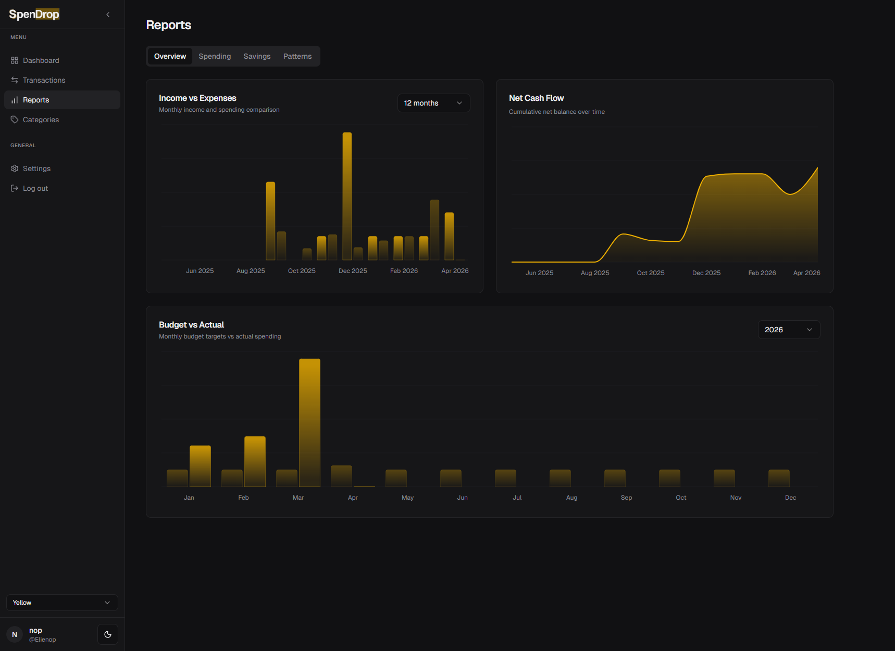
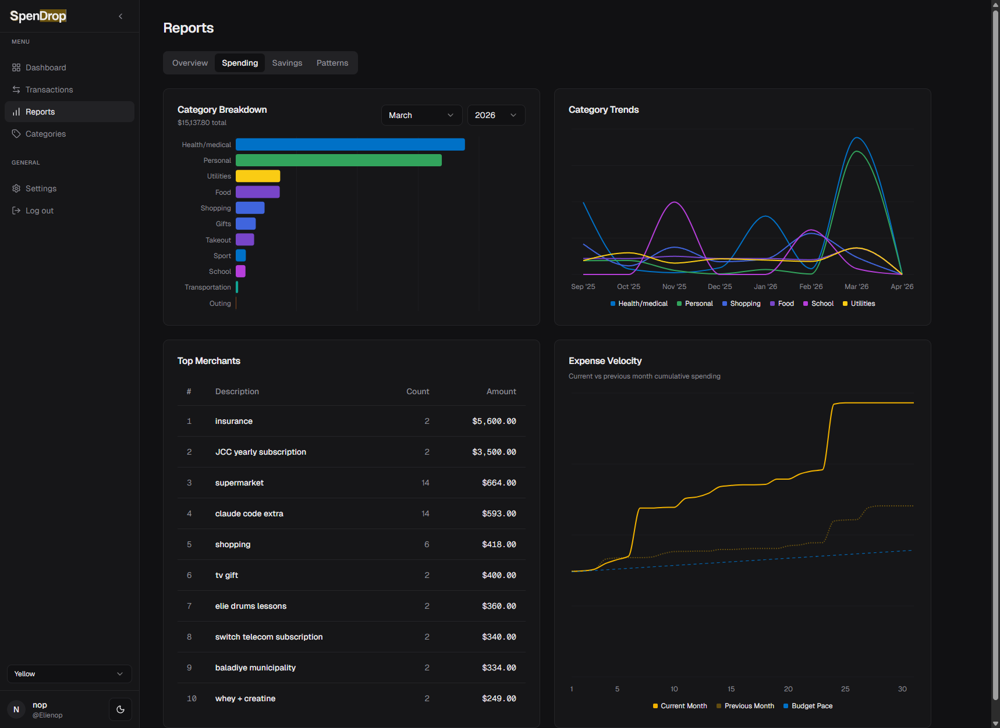
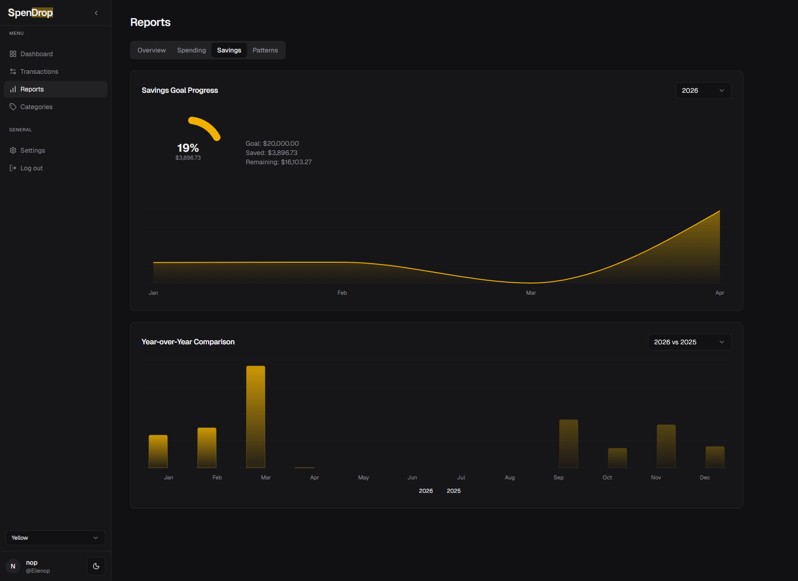
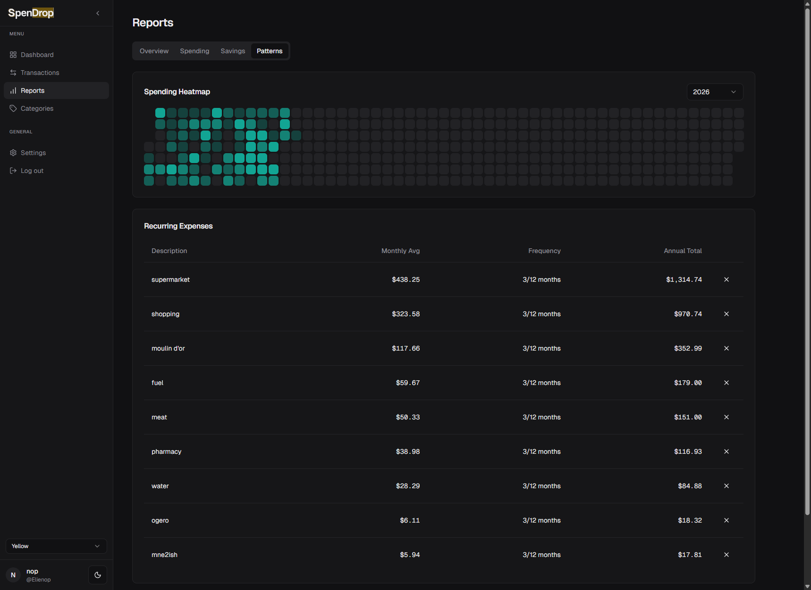

### Budgets

Plan and track your spending limits on a dedicated page with two editors:

- **Monthly Budgets** -- One row per month for the chosen year. Quick actions apply the same amount to every month or copy the previous year's plan; the year picker, sidebar clicks, and browser Back / Forward all prompt to discard before losing unsaved edits.
- **Category Limits** -- Optional per-category monthly spending caps. Admins set them; everyone can read them. Compared against actual spend in Reports.

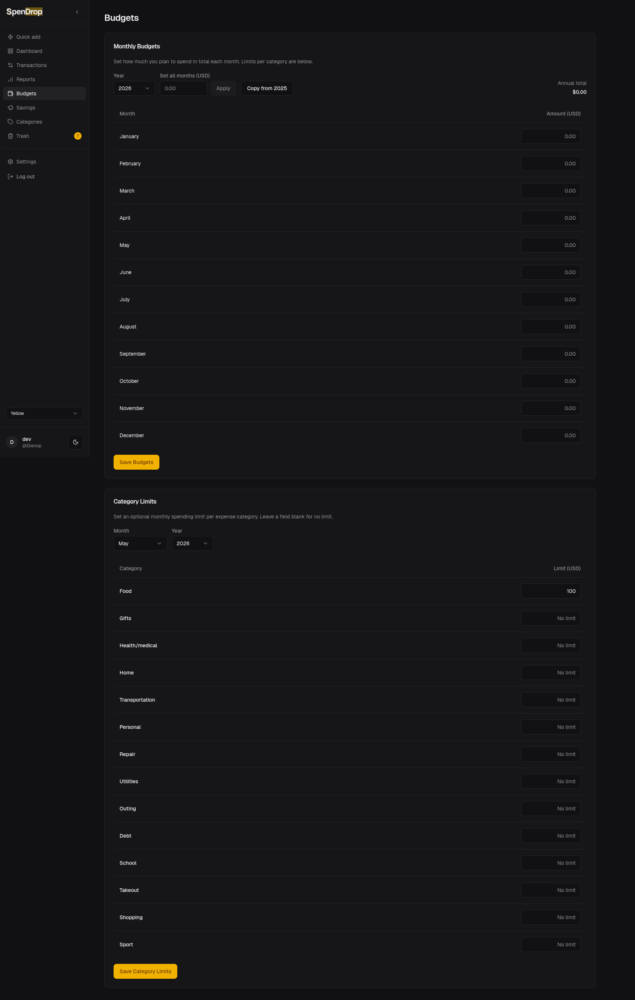

### Savings

Yearly **Savings Goals** are set on their own page and tracked under Reports → Savings. Picking a year that already has a goal surfaces a "Replace" warning -- title, button, and toast all flip so the new amount can't silently overwrite the old one. Deletes go through an explicit confirm dialog.

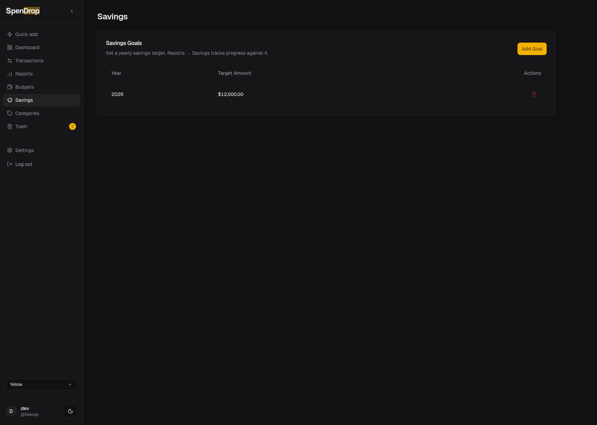

### Categories

Manage expense and income categories with color-coded badges, type labels (Expense/Income), and per-row action menus (edit, deactivate, delete). Deactivated categories stay attached to past transactions but no longer appear in the entry dropdown.

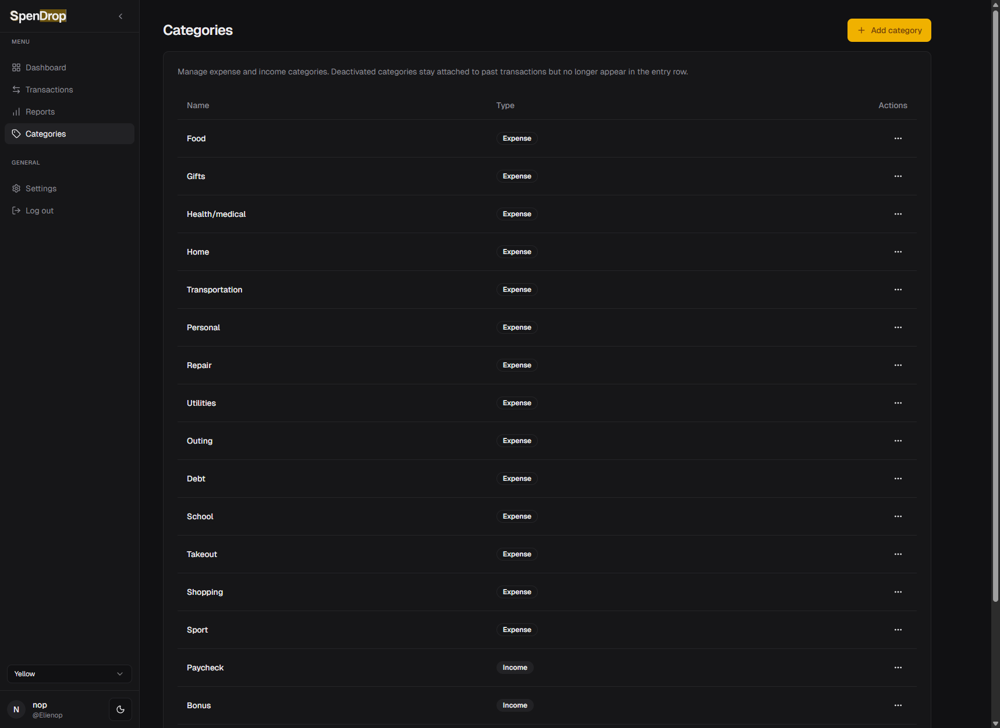

### Settings

Tabbed settings page covering account and system configuration. Monthly Budgets, Category Limits, and Savings Goals each have their own top-level page (see [Budgets](#budgets) and [Savings](#savings) above); old `?tab=budgets` / `?tab=savings` / `?tab=general` bookmarks land on Account with a one-shot toast offering to open the new page directly.

- **Account** -- Change your own password. Changing it signs you out everywhere and revokes all of your API tokens. Available to every user.
- **Currencies** -- Manage currencies with exchange rates (LBP, EUR to USD base)
- **Users** -- Admin user management (create, edit roles, delete, and reset a member's password)
- **API tokens** -- Mint, list, and revoke long-lived bearer tokens scoped to your user account. Tokens are show-once on creation (you will never see the plaintext again) and are revoked automatically when you change your password. Use them to authenticate any script, dashboard, or third-party integration against SpenDrop without a browser session — see [Using API tokens](#using-api-tokens) for curl and Homepage examples.
- **Import / Export** -- Upload Excel files, preview and edit rows inline (date / description / amount), mark rows to skip, resolve duplicate-content collisions before confirming; export transactions or monthly/yearly reports. Sessions persist for 60 minutes and survive browser reloads.

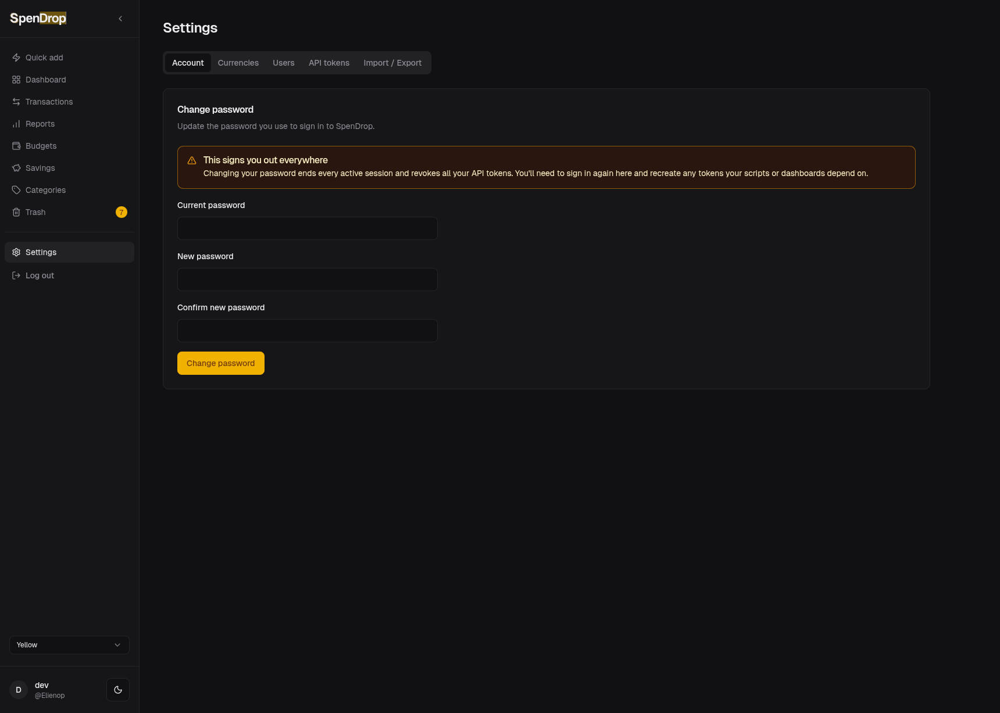

### Authentication

Simple username/password auth with bcrypt hashing and HTTP-only session cookies. Any `/api/*` route additionally accepts `Authorization: Bearer <token>` for programmatic callers — issue a token from **Settings → API tokens** and paste it into your client's config (curl, shell scripts, dashboards, third-party integrations). Bearer requests skip CSRF (session cookies are only attached to browser requests) and are rate-limited per source IP on authentication failures. The first registered user automatically becomes admin. Supports admin and member roles. Users can change their own password from **Settings → Account** (which logs them out everywhere and revokes their API tokens); admins can reset any member's password from **Settings → Users**.

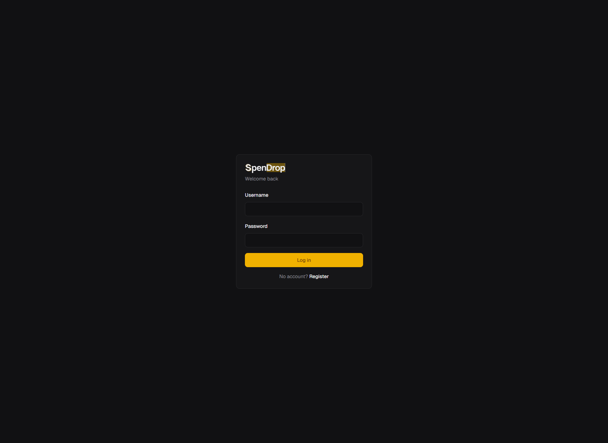
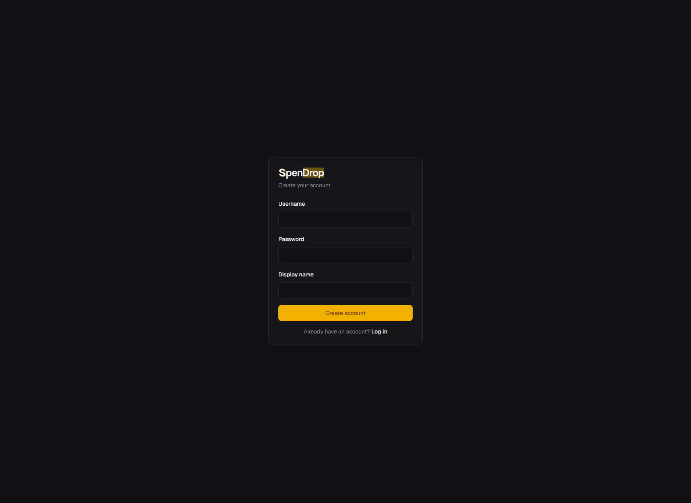

### Additional Features

- **Dark and light themes** with system preference detection, toggle in sidebar
- **Collapsible sidebar** with pin toggle, state persisted in localStorage. A small counter next to **Trash** shows how many transactions are waiting to be restored or purged (a colored dot in collapsed mode), tinted to the user's chosen accent theme
- **Color theme picker** in the sidebar (Violet, Yellow, Blue, ...) -- the chosen accent flows through buttons, the active sidebar row, and the Trash counter so the whole app stays in palette
- **Responsive layout** with max-width 1400px for wide-screen readability
- **Saved filters** -- save and recall transaction filter presets
- **Bulk operations** -- select transactions on the current page, or select every row matching the current filter across pages, for batch delete or bulk field edit
- **Find and replace** -- search transactions and replace descriptions in bulk
- **Excel export** -- export all transactions, or by month/year, as `.xlsx` files

## Tech Stack

| Layer | Technology |
|-------|-----------|
| Backend | Go 1.26 (chi router, sqlc) |
| Frontend | React 19 + TypeScript (Vite) |
| Database | SQLite (WAL mode) |
| UI Components | shadcn/ui + Tailwind CSS |
| Charts | Recharts |
| Icons | Lucide React |
| Auth | bcrypt + HTTP-only cookies |
| Deploy | Docker (multi-stage build) |

## Quick Start with Docker

The fastest way to run SpenDrop:

```bash
# Clone the repo
git clone https://github.com/elienop/spendrop.git
cd spendrop

# Start the container
docker compose up -d
```

SpenDrop is now running at **http://localhost:3535**. Data is persisted in a Docker volume (`spendrop-data`).

### First Login

1. Open http://localhost:3535
2. Click **Register** to create your account
3. The first user automatically becomes **admin** with full access
4. Additional users can be created from Settings > Users as members

## Development Setup

### Prerequisites

- Go 1.26+
- Node.js 20+
- GCC (required for go-sqlite3 CGO compilation)

### Backend

```bash
go run ./cmd/spendrop
```

The server starts on `http://localhost:8080`. On first run it creates `spendrop.db` and applies all migrations automatically.

### Frontend

```bash
cd web
npm install
npm run dev
```

The Vite dev server starts on `http://localhost:5173` and proxies `/api` requests to the Go backend.

### Running Tests

```bash
# Backend tests
go test ./...

# Frontend tests
cd web
npm test
```

### Linting

```bash
cd web
npm run lint        # TypeScript + ESLint
```

### Documentation

The committed [`docs/SCHEMA.md`](docs/SCHEMA.md) is a concatenation of every SQL migration under `internal/database/migrations/`, generated by `cmd/schema-doc` so the schema stays readable even if the Go toolchain stops building in some future year. Regenerate it after adding a migration:

```bash
make docs
```

On Windows (or any host without `make`), run the underlying command directly:

```bash
go run ./cmd/schema-doc > docs/SCHEMA.md
```

CI re-runs `make docs` on every PR and fails if `docs/SCHEMA.md` would change — a forgotten regen can't land on `main` silently.

> **sqlc is hand-maintained, not generated.** `sqlc generate` does *not* work on this repo — sqlc's SQLite parser rejects the `RETURNING` clauses and window functions used across the report/checkpoint/API-token queries. So `internal/database/queries.sql.go` and `models.go` are edited **by hand** to match `queries.sql`, despite their `// Code generated by sqlc. DO NOT EDIT.` header (don't trust it). After changing a query, hand-update the corresponding function + structs and verify with `go build ./...` + `go test ./...`. There is no CI drift-check for this (you can't diff against a generator that won't run), so the build and tests are the guard — keep every query exercised by a test.

### Environment Variables

Most deployments only need the first handful of variables. Everything below is a runtime knob that defaults to a sensible production value — set them only when you have a specific reason.

#### Container / host

| Variable | Default | Description |
|----------|---------|-------------|
| `PUID` | `911` | User ID for file ownership |
| `PGID` | `911` | Group ID for file ownership |
| `TZ` | `UTC` | Container timezone (e.g. `Asia/Beirut`, `Europe/Berlin`) |
| `PORT` | `8080` | Server listen port |
| `DB_PATH` | `spendrop.db` | SQLite database file path. The Docker image overrides this to `/app/data/spendrop.db` so the file lands in the mounted volume |

#### Cookies, proxies, and CORS

| Variable | Default | Description |
|----------|---------|-------------|
| `COOKIE_SECURE` | `auto` | Session cookie `Secure` flag. `auto` detects from request scheme; set `true` when behind an HTTPS reverse proxy, `false` for plain-HTTP LAN deployments |
| `TRUST_PROXY` | _(unset)_ | When `true`, honor `X-Forwarded-Proto` for HTTPS detection. Only enable behind a trusted reverse proxy (Caddy, nginx, Traefik) |
| `CORS_ORIGIN` | _(unset)_ | Allowed CORS origin for split-origin deployments. Leave unset for same-origin (default). Example: `https://spendrop.example.com` |
| `SPENDROP_INSECURE` | _(unset)_ | **Deprecated** — alias for `COOKIE_SECURE=false`. Use `COOKIE_SECURE=false` instead |

#### HTTP server tuning

| Variable | Default | Description |
|----------|---------|-------------|
| `HTTP_READ_HEADER_TIMEOUT` | `5s` | Max time allowed to read request headers. Accepts any Go `time.Duration` (e.g. `500ms`, `2s`) |
| `HTTP_READ_TIMEOUT` | `15s` | Max time to read the entire request |
| `HTTP_WRITE_TIMEOUT` | `60s` | Max time to write the response. Raise this if you return large exports |
| `HTTP_IDLE_TIMEOUT` | `120s` | Max keep-alive idle time |
| `SHUTDOWN_GRACE` | `10s` | How long the server waits for in-flight requests during graceful shutdown |

#### Sessions and passwords

| Variable | Default | Description |
|----------|---------|-------------|
| `SESSION_TTL` | `720h` (30 days) | Session cookie lifetime |
| `SESSION_CLEANUP_INTERVAL` | `1h` | How often the background job purges expired sessions |
| `SESSION_TOKEN_BYTES` | `32` | Bytes of entropy per session token (16–128; the token is hex-encoded into the cookie, so larger values stop browsers storing it) |
| `BCRYPT_COST` | `12` | bcrypt work factor (4-31). Higher is slower but harder to brute force |
| `PASSWORD_MIN_LENGTH` | `8` | Minimum password length |
| `PASSWORD_MAX_LENGTH` | `72` | Maximum password length. Must be ≤ 72 (bcrypt's input limit) |

#### Rate limiting

| Variable | Default | Description |
|----------|---------|-------------|
| `RATE_LIMIT_MAX` | `10` | Attempts allowed per client per window before login/register return 429. A "client" is the address for IPv4 (`/32`) and the **`/64` prefix** for IPv6 — ISPs delegate a routed `/64` to each customer, so keying on the full IPv6 address would let one host mint a fresh bucket per request and bypass the limiter entirely. Two different IPv6 `/64`s are still counted separately |
| `RATE_LIMIT_WINDOW` | `1m` | How often attempt counters are reset |
| `TRUST_PROXY_HEADERS` | `false` | Derive the rate-limit client IP from `X-Forwarded-For` instead of the socket address. **Set this to `true` if and only if SpenDrop sits behind a reverse proxy you control**, and set `TRUSTED_PROXY_CIDRS` along with it — enabling this without CIDRs is refused at startup, because the header cannot then be told apart from a forgery. Behind a proxy with it `false`, every request carries the proxy's address, so the whole household shares one bucket and a single attacker locks everyone out. Directly exposed with it `true`, the header is attacker-controlled and anyone can mint a fresh bucket per request, bypassing the limiter entirely |
| `TRUSTED_PROXY_CIDRS` | *(empty)* | Comma-separated address ranges of your reverse proxies, as CIDRs or bare IPs — e.g. `172.18.0.0/16` (a Docker compose network) or `172.18.0.5`. **Required when `TRUST_PROXY_HEADERS=true`.** `X-Forwarded-For` is honoured **only when the connection itself came from one of these ranges**, so anything reaching SpenDrop directly (a LAN host, a sibling container, a port exposed next to the proxy) is keyed on its socket address and cannot forge an identity. The client is then chosen by **address**: the header is walked from the right while entries fall inside these ranges, and the first entry that does not is the client. Anything an attacker prepends sits further left and is never reached, so this is safe no matter how long the real chain is. **The ranges must cover your proxies and nothing else** — any host inside them is trusted to declare who the client is, so derive the range from your own network rather than copying a wide default (see [Caddy Reverse Proxy](#caddy-reverse-proxy)) |

#### Uploads, database, and backups

| Variable | Default | Description |
|----------|---------|-------------|
| `MAX_JSON_BYTES` | `1048576` (1 MiB) | Maximum size of a JSON request body |
| `MAX_UPLOAD_BYTES` | `10485760` (10 MiB) | Maximum size of a multipart file upload (xlsx import) |
| `SQLITE_BUSY_TIMEOUT` | `5s` | SQLite busy timeout. Raise this if you see `database is locked` errors under heavy concurrent writes |
| `BACKUP_ENABLED` | `true` | Enable the in-process scheduled backup loop. Set `false` to disable it entirely; no other `BACKUP_*` variables are validated when disabled |
| `BACKUP_INTERVAL` | `24h` | How often the scheduler runs a backup. Must be at least `1h` |
| `BACKUP_DIR` | `backups` | Where backups are written. The Docker image overrides this to `/app/data/backups` so the files land in the mounted volume |
| `BACKUP_KEEP_DAILY` | `7` | Distinct calendar days retained, **plus** the most-recent 7 snapshots so a sub-daily `BACKUP_INTERVAL` also keeps intra-day restore points. The calendar half is what makes the recovery window independent of `BACKUP_INTERVAL` |
| `BACKUP_KEEP_CORRUPT` | `2` | Quarantined `.corrupt` backups retained for forensics. Bounded deliberately: a failed verify writes a full-size copy of the database into `BACKUP_DIR`, which shares a volume with the live database, so an unbounded quarantine ends in ENOSPC. Set `0` to retain none — useful on a tight volume, at the cost of losing the evidence of *why* a backup failed. The effective value is printed in the scheduler's startup log line |
| `BACKUP_KEEP_WEEKLY` | `4` | Distinct ISO weeks retained |
| `BACKUP_KEEP_MONTHLY` | `12` | Distinct calendar months retained. The sum of the three `BACKUP_KEEP_*` counts must be ≥ 1 — setting all three to `0` is rejected at startup because the current tick's own backup would be pruned on the same tick |

#### Notifications (Web Push)

| Variable | Default | Description |
|----------|---------|-------------|
| `PUSH_ENABLED` | `false` | Enable Web Push budget-over notifications. When `false` the feature is a hard no-op and the `VAPID_*` variables are ignored |
| `VAPID_PUBLIC_KEY` | _(unset)_ | base64url P-256 public key. Required when `PUSH_ENABLED=true` |
| `VAPID_PRIVATE_KEY` | _(unset)_ | base64url P-256 private key. Required when `PUSH_ENABLED=true`. Never logged or returned by any handler |
| `VAPID_SUBJECT` | _(unset)_ | `mailto:` or `https:` contact URL for the VAPID JWT `sub` claim. Required when `PUSH_ENABLED=true` |

See [Notifications (Web Push)](#notifications-web-push) for setup, key rotation, and TrueNAS redeploy notes.

## Docker Configuration

The Docker setup uses a multi-stage build (Go builder, Node builder, Alpine runtime) for a minimal final image.

```yaml
# docker-compose.yml
services:
  spendrop:
    image: ghcr.io/elienop/spendrop:latest
    container_name: spendrop
    ports:
      - "3535:8080"     # Change 3535 to your preferred port
    volumes:
      - spendrop-data:/app/data
    environment:
      - PUID=1000
      - PGID=1000
      - TZ=UTC              # e.g. Asia/Beirut, Europe/Berlin
      # Cookie security mode. Default "auto" detects from the request scheme.
      # Set to "true" when behind an HTTPS reverse proxy (with TRUST_PROXY=true).
      # Set to "false" for plain-HTTP LAN deployments.
      # - COOKIE_SECURE=auto
      # - TRUST_PROXY=true
      # CORS origin for split-origin deployments. Leave unset for same-origin.
      # - CORS_ORIGIN=https://spendrop.example.com
    restart: unless-stopped

volumes:
  spendrop-data:        # Persistent storage for SQLite database
```

### Upgrading from an earlier version

Before this release SpenDrop marked the session cookie `Secure` by default unless you set the old `SPENDROP_INSECURE=true`. The new default `COOKIE_SECURE=auto` detects the scheme from the incoming request instead.

If you run behind an HTTPS reverse proxy, the backend sees plain HTTP on its internal port, so `auto` will emit a non-`Secure` cookie unless you tell it the proxy is trusted. To keep the old (stronger) behavior, add both:

```yaml
environment:
  - COOKIE_SECURE=true
  - TRUST_PROXY=true
```

Plain-HTTP LAN deployments that previously worked with `SPENDROP_INSECURE=true` will keep working — `SPENDROP_INSECURE` is now a deprecated alias for `COOKIE_SECURE=false`, but `COOKIE_SECURE=false` is preferred in new configs.

### Deployment Scenarios

**Plain HTTP on your LAN** (e.g. `http://192.168.1.10:3535`):

```yaml
environment:
  - COOKIE_SECURE=false
```

Without this, browsers drop the session cookie because it would otherwise be marked `Secure` on a non-HTTPS origin, causing a 401 on every request after login.

The **installable PWA** (home-screen install, service worker, offline capture) does **not** activate over plain HTTP — browsers require a secure origin. Plain-HTTP LAN access still gives you the full web app while online; for the installable/offline mobile experience, serve SpenDrop over HTTPS (see [Caddy Reverse Proxy](#caddy-reverse-proxy)).

**Behind an HTTPS reverse proxy** (Caddy, nginx, Traefik):

```yaml
environment:
  - COOKIE_SECURE=true
  - TRUST_PROXY=true
```

`TRUST_PROXY=true` is required so the Go backend honors `X-Forwarded-Proto` from the upstream proxy. Only enable it when the container is not directly reachable from untrusted networks — a spoofed header would otherwise bypass the HTTPS check.

### Caddy Reverse Proxy

[Caddy](https://caddyserver.com) is the simplest way to put SpenDrop behind a real domain with automatic TLS from Let's Encrypt. Point an `A`/`AAAA` record at your server, then:

**First, find the subnet Caddy will reach SpenDrop from.** `TRUSTED_PROXY_CIDRS` decides who is allowed to declare the client's identity to the login rate limiter, so it has to name your proxy and nothing else. Bring the stack up once (`docker compose up -d`) and read the real subnet off the network Compose created:

```bash
docker network inspect "$(basename "$PWD")_default" \
  -f '{{range .IPAM.Config}}{{.Subnet}}{{end}}'
# e.g. 172.19.0.0/16
```

Put that value in `TRUSTED_PROXY_CIDRS` below, then `docker compose up -d` again. Pinning the network in Compose (a top-level `networks:` block with an explicit `ipam.config.subnet`) keeps the value stable across recreates.

```yaml
# docker-compose.yml
services:
  caddy:
    image: caddy:2-alpine
    container_name: caddy
    ports:
      - "80:80"
      - "443:443"
    volumes:
      - ./Caddyfile:/etc/caddy/Caddyfile:ro
      - caddy-data:/data
      - caddy-config:/config
    restart: unless-stopped

  spendrop:
    image: ghcr.io/elienop/spendrop:latest
    container_name: spendrop
    # No host port needed — Caddy reaches it over the internal network
    expose:
      - "8080"
    volumes:
      - spendrop-data:/app/data
    environment:
      - PUID=1000
      - PGID=1000
      - TZ=UTC
      - COOKIE_SECURE=true
      - TRUST_PROXY=true
      # Without these two, every request arrives carrying Caddy's address, so the
      # whole household shares one login rate-limit bucket and a single attacker
      # locks everyone out.
      #
      # TRUSTED_PROXY_CIDRS must name the range Caddy connects from AND NOTHING
      # ELSE — every host inside it is trusted to declare who the client is. For
      # this compose file that is the project's own bridge network. Look up your
      # real subnet BEFORE you start (see the note under this file) and put it
      # here; the value below is a placeholder, not a default that will fit.
      - TRUST_PROXY_HEADERS=true
      - TRUSTED_PROXY_CIDRS=172.18.0.0/16  # ← replace with YOUR project's subnet
    restart: unless-stopped

volumes:
  spendrop-data:
  caddy-data:
  caddy-config:
```

```caddy
# Caddyfile
spendrop.example.com {
    reverse_proxy spendrop:8080
}
```

> **Do not fall back to `172.16.0.0/12` unless you have no alternative.** That is Docker's entire default address pool, so it trusts *every* container on the host — any other app you run, including one you did not write, can then declare who the client is: mint an unlimited number of rate-limit buckets to brute-force a password, or pin a household member's bucket at `429` so they cannot log in. On a multi-app NAS (TrueNAS SCALE, Unraid, Synology) that is the normal situation, not an edge case. Use it only as a temporary measure on a host running nothing else you would not trust, and narrow it as soon as you know your real subnet.

Caddy automatically provisions and renews a TLS certificate for `spendrop.example.com` on first start. That HTTPS origin is also what enables the installable PWA — home-screen install and offline capture both require a secure context (see [Mobile capture](#mobile-capture-installable-pwa)).

### Live updates

SpenDrop keeps every **open** device current automatically. When anyone in the household adds, edits, or deletes a transaction (or changes a budget, category, savings goal, or currency), every other open SpenDrop tab refreshes the affected views — transaction list, dashboard, reports, trash counter — within about a second, **with no manual refresh**. It works over a single long-lived [Server-Sent Events](https://developer.mozilla.org/en-US/docs/Web/API/Server-sent_events) stream on `GET /api/events`, authenticated by your existing session cookie.

This is **always on** — there is no environment variable to enable it, no secret to generate, and nothing to turn on per device. If the stream is ever unavailable (proxy misconfigured, flaky network), the app silently falls back to refreshing whenever a tab regains focus or reconnects, so your data is never stale for long. No transaction data crosses the event stream — only a tiny hint telling the browser which views to re-fetch through the normal authenticated API.

#### Reverse-proxy requirement

Server-Sent Events are a streaming response: the proxy must forward each event the instant the server writes it, and must **not** compress the stream. Caddy buffers and compresses by default, which would make events arrive in a clump (or never) — so the `/api/events` route needs two adjustments:

1. `flush_interval -1` on its `reverse_proxy` — forward every write immediately instead of buffering.
2. Exclude `/api/events` from `encode` (compression) — a compressed SSE stream never flushes per event.

A SpenDrop site block that handles both, adapted from the basic example above:

```caddy
# Caddyfile
spendrop.example.com {
    @sse path /api/events
    @notsse not path /api/events

    # Live-update stream: forward each event immediately, never buffer.
    handle @sse {
        reverse_proxy spendrop:8080 {
            flush_interval -1
        }
    }

    # Everything else: normal proxying.
    handle {
        reverse_proxy spendrop:8080
    }

    # Compress responses, but never the SSE stream (compression defeats per-event flush).
    encode @notsse gzip zstd
}
```

Replace `spendrop:8080` and `spendrop.example.com` with the upstream and domain from your own setup. The load-bearing pieces are `flush_interval -1` on the SSE route and the `not path /api/events` exclusion from `encode` — the surrounding structure can follow whatever your existing Caddyfile already does.

Caddy serves the public side over **HTTP/2** by default (any HTTPS site), which matters here: the old HTTP/1.1 6-connections-per-origin limit would let a couple of open SpenDrop tabs starve the rest of the app of connections while the SSE stream holds one open. Over HTTP/2 the stream is one multiplexed substream, so it costs nothing against that cap. You get this for free as long as the site is served over HTTPS through Caddy — no extra directive needed.

After editing the Caddyfile, reload Caddy (`docker exec caddy caddy reload --config /etc/caddy/Caddyfile`, or `caddy reload` on a host install) and the live-update stream is active. No SpenDrop redeploy is required for the proxy change.

### Backup and Restore

SpenDrop takes a consistent, WAL-aware backup of your database every 24 hours by default. Backups land in `/app/data/backups/` inside the `spendrop-data` volume as timestamped files like `spendrop-2026-04-13T0300Z.db` (ISO-8601, UTC, minute precision, no colons so they work on every filesystem). Each backup is accompanied by a `.sha256` sidecar that is **only** written after the file passes three checks:

1. Size sanity — at least one SQLite page, and at most 10× the previous successful backup (the cheap check runs first so an obviously broken file never even opens SQLite)
2. `PRAGMA integrity_check` returns `ok`
3. Row-count parity against the live `transactions` table (tolerates a single in-flight write that landed between the count and the snapshot)

If any check fails, the file is renamed to `<name>.db.corrupt`, no sidecar is written, and the scheduler loop survives so the next tick still fires. The **presence of a `.sha256` sidecar is the "this file is trusted" marker** — the restore drill below relies on it, and so does the prune logic that trims old backups. `.corrupt` files sit outside the GFS buckets but are **not** kept forever: the newest `BACKUP_KEEP_CORRUPT` (default 2) are retained for you to inspect and the rest are swept. Each one is a full-size copy of the database and `BACKUP_DIR` shares a volume with the live database, so an unbounded quarantine would eventually fill the disk and take the database down with it.

Old backups are pruned on a grandfather-father-son schedule: by default, 7 daily, 4 weekly, 12 monthly — roughly 115 MB of backup history for a typical household database.

Every successful backup emits a single log line you can grep for in `docker logs spendrop`:

```
backup ok: spendrop-2026-04-13T0300Z.db (4.8 MB, 9842 rows, sha256 a1b2c3d4e5f6…) in 87ms
```

> **Do not** use `docker cp spendrop:/app/data/spendrop.db` on a running container. SQLite in WAL mode keeps uncommitted writes in `spendrop.db-wal` and `spendrop.db-shm`. A naive copy of just `spendrop.db` can be silently inconsistent or lose recent transactions on restore. Use the scheduled backup or the `spendrop backup` subcommand below instead.

#### Take an immediate backup

```bash
docker exec spendrop ./spendrop backup /app/data/backups/manual-$(date -u +%Y%m%dT%H%MZ).db
```

The subcommand refuses to overwrite an existing file and writes both the `.db` and its `.sha256` sidecar atomically. Running it a second time with the same target exits non-zero without touching the existing file.

#### Tunables

Backup behavior is controlled by seven environment variables — `BACKUP_ENABLED`, `BACKUP_INTERVAL`, `BACKUP_DIR`, `BACKUP_KEEP_DAILY`, `BACKUP_KEEP_WEEKLY`, `BACKUP_KEEP_MONTHLY`, `BACKUP_KEEP_CORRUPT`. All seven are documented in the [Uploads, database, and backups](#uploads-database-and-backups) section of the environment variables table. Most deployments never need to change any of them; the common adjustments are `BACKUP_INTERVAL=12h` for twice-daily backups and `BACKUP_ENABLED=false` for throwaway test environments.

#### Restore drill — do this at least once before you trust the system

A backup you have never restored from is a wish, not a backup. Run this drill once on your actual deployment so you know the commands work, the permissions are right, and the data comes back intact. It takes about two minutes.

```bash
# 1. Pick a backup to restore (newest is usually what you want)
docker exec spendrop ls -lt /app/data/backups/

# 2. Verify the checksum still matches the file.
#    Replace the filename with the one you picked in step 1.
docker exec spendrop sh -c 'cd /app/data/backups && sha256sum -c spendrop-2026-04-13T0300Z.db.sha256'

# 3. Stop the container so the live DB is closed cleanly
docker compose stop spendrop

# 4. Replace the live DB. Keep the old one with a .bak suffix in case the
#    restore is wrong. The -wal and -shm files belong to the OLD database —
#    leaving them in place would corrupt the restored one.
docker run --rm -v spendrop-data:/data alpine sh -c '
  mv /data/spendrop.db /data/spendrop.db.bak &&
  rm -f /data/spendrop.db-wal /data/spendrop.db-shm &&
  cp /data/backups/spendrop-2026-04-13T0300Z.db /data/spendrop.db
'

# 5. Start the container back up
docker compose start spendrop

# 6. Verify with a real query
curl -s http://localhost:3535/api/health
#    Then log in and spot-check that the most recent transactions are present.
```

If something looks wrong, you can roll back to the original by repeating step 4 with `spendrop.db.bak` as the source. Once the restore is verified, delete the `.bak` file to reclaim space.

#### Integrity checks

SpenDrop runs a full `PRAGMA integrity_check` **synchronously at startup** — after migrations, before the HTTP server binds a port — and refuses to start on any non-`ok` result. A corrupt database under a live server compounds damage with every write, so the right operator response is "crash loudly, restore from backup, investigate" rather than "limp along and hope." The full result (not just pass/fail) is logged verbatim so the exact SQLite error list is in `docker logs spendrop`.

Once the server is up, a background ticker reruns the full check **every 24 hours** and caches the result. `GET /healthz/data` surfaces both the cached full-check result (`last_integrity_check_at`, `last_integrity_check_result`) and a per-request `PRAGMA quick_check` that catches torn page writes between scheduled runs. Monitoring scrapers should alert on the HTTP status code (503 on degraded) and include the response body in the alert payload so the exact wording reaches the operator without needing another shell.

#### Pre-migration snapshots

Schema migrations are the riskiest thing SpenDrop does to your database — a bug in a new migration can corrupt data in ways the scheduled backup may not have captured yet if the last one was hours ago. Before applying **any** pending migration on startup, SpenDrop writes a dedicated `VACUUM INTO` snapshot to `/app/data/migration-snapshots/` so you always have a pre-upgrade anchor, no matter when the last scheduled backup ran.

Snapshot filenames carry the migration version they are capturing *state before*, e.g. `pre-migration-004_drop_categories_color-2026-04-13T175643Z.db`. Each snapshot has a `.sha256` sidecar with the same trust semantics as the Tier 1 backups above — if the sidecar is present, the file passed the `PRAGMA integrity_check` and row-count checks before being committed.

- **Refuses to start if the snapshot fails.** If the snapshot directory is read-only, full, or missing, the server process exits non-zero with a "refusing to migrate" error and the database is left at its pre-migration version. Fix the disk condition and restart — the migration will retry from the same state.
- **Hardcoded retention.** The three most recent snapshots are kept; older ones are pruned automatically on the next successful migration. The count is not tunable by design: snapshots are short-term recovery anchors, not history, and the sibling Tier 1 scheduled backups cover the longer tail.
- **No-op on clean boots.** If there are no pending migrations, no snapshot is written. A normal restart does not churn the directory.

To restore from a migration snapshot, follow the same restore drill above but with a `pre-migration-*.db` file as the source in step 4. The snapshot is a full SQLite database — the restore steps are identical.

#### Mutation audit log

Every change to a transaction — create, update, delete, batch create, batch delete, bulk rename, delete-by-filter, batch-update, update-by-filter — writes an append-only row to the `transaction_audit` table **in the same SQL transaction as the mutation**. The audit row exists if and only if the mutation committed: a rollback of either rolls back both. This means you always have a record of *who changed what, and when*, even if the row itself is later hard-deleted.

The table stores the action (`insert` / `update` / `delete`), the acting user (`actor_user_id`, which is `ON DELETE SET NULL` so history outlives the account), the timestamp, and JSON blobs of the row state before and after the mutation. Single-row operations get one audit row per transaction touched. **ID-list bulk operations** (`batch-delete`, `batch-update`) get one audit row per row touched plus a summary row when any IDs were skipped. **Filter-scoped bulk operations** (`delete-by-filter`, `update-by-filter`, `bulk-rename`) get a single summary row with `transaction_id = 0` and a payload like `{"bulk":true,"count":142,"filter":"..."}` — per-row diffs for an endpoint that can rename tens of thousands of rows in a single call would balloon the audit table and slow the operation the endpoint exists to serve.

> The audit log is a **CLI-only operator tool**, not a user-facing feature. There is no REST endpoint that returns audit rows, no UI to browse them, and no per-user authorization check. Read access is via `docker exec` into the container — treat it like a database log, not like a timeline.

The `spendrop audit` subcommand dumps matching rows as JSON-lines on stdout so the output composes cleanly with `jq`, `grep`, and `less`:

```bash
# Every audit row for one transaction, oldest first — the full lifecycle
# of a single row including any updates before it was deleted.
docker exec spendrop ./spendrop audit --transaction-id 1234

# Recent mutations across the whole database (default: last 24h, cap 100 rows,
# newest first). Bulk summary rows show up here with transaction_id=0.
docker exec spendrop ./spendrop audit

# Everything since a specific wall-clock date, up to 500 rows. The --since
# flag accepts either YYYY-MM-DD (interpreted as UTC midnight) or RFC3339.
docker exec spendrop ./spendrop audit --since 2026-04-01 --limit 500

# Pipe into jq for readable diffs — useful when investigating "who renamed
# these 200 transactions last Tuesday?"
docker exec spendrop ./spendrop audit --since 2026-04-07 \
  | jq -r 'select(.transaction_id == 0) | "\(.occurred_at) actor=\(.actor_user_id // "?") \(.before_json)"'
```

The audit table is append-only by convention — application code never `UPDATE`s or `DELETE`s rows from it — so the table grows over the lifetime of the deployment. For a typical household the growth is negligible (a few KB per mutation, most days produce fewer than ten mutations). If you ever need to prune it for forensic reasons, do so from `sqlite3` directly, not from the app.

#### Off-host transport (pick one)

Backups in the same Docker volume protect you from application bugs and accidental deletes inside the app, but **not** from the host disk dying or the SD card wearing out. Copy backups off the box on whatever schedule fits your paranoia level. Three reasonable choices:

- **[rclone](https://rclone.org)** — many cloud backends (Backblaze B2, S3, Google Drive, Dropbox, WebDAV…), single binary, simplest "copy this folder somewhere else" tool. Good default if you already have any cloud storage.
- **[restic](https://restic.net)** — deduplicating, encrypted, append-only repositories. Slightly more setup; pays off when you want years of history without paying for years of storage.
- **rsync to a NAS** — LAN-only, no encryption, no cloud, no monthly cost. The right answer if your threat model is "the Pi's SD card dies" and not "the house burns down".

Run any of these from the host (or another container) against the bind path of the named volume:

```bash
# Find the host path
docker volume inspect spendrop-data --format '{{ .Mountpoint }}'
# /var/lib/docker/volumes/spendrop-data/_data
```

Then point your tool of choice at `<mountpoint>/backups/`. **Don't forget to also copy the `.sha256` sidecars** — they're how the restore drill decides which backup is trustworthy when you pull one back from off-host storage.

### Threat model and encryption at rest

SpenDrop stores everything in a single SQLite file at `/app/data/spendrop.db`. Encrypting that file at rest is a good idea — but only if you are clear about *what* it protects.

**What disk-level encryption protects:**
- A stolen laptop, NAS drive, or decommissioned hard disk that is powered off when stolen.
- Backups copied off the host (provided the backup is also encrypted, which is a separate problem).
- An attacker with physical access to the storage medium but not to a running, unlocked system.

**What it does NOT protect:**
- A running container. Anyone with `root` on the host machine can `sqlite3 /app/data/spendrop.db .dump` because the kernel has already decrypted it for the running process.
- Live memory dumps. The encryption key and SQLite's cached database pages (page cache plus any uncheckpointed WAL frames) sit in RAM in plaintext.
- Application-level attacks: a compromised SpenDrop binary, a stolen session cookie, an SQL-injection bug — encryption at rest is invisible to all of these.
- Network traffic. That is what TLS via the Caddy reverse proxy (above) is for. Encryption at rest and encryption in transit are *different problems*.

If your threat model is "my landlord might unplug the NAS and walk off with it," disk encryption is exactly right. If it is "my roommate has shell access to the box," disk encryption does nothing — you need OS user separation and TLS instead.

**Why SpenDrop does not integrate SQLCipher:** SQLCipher requires CGO with a custom build of SQLite, has no upstream support in `mattn/go-sqlite3`, complicates key management (where do you store the key? how do you rotate it? what happens during a migration?), and adds per-query overhead — all to solve a problem that the operating system already solves better, with hardware acceleration, with a key hierarchy your distro already understands. The honest recommendation is: encrypt the volume that holds `/app/data`, not the SQLite file itself.

**Recommended approaches by platform:**

| OS / filesystem | Tool | When to pick it |
| --- | --- | --- |
| Linux, single disk | LUKS (dm-crypt) | The default. Use whatever your distro installer offered. |
| Linux, ZFS pool | ZFS native encryption | If you already run ZFS, do not bolt LUKS on top — use the built-in. |
| Linux, container volume only | LUKS on a loopback file (via `losetup`) | When you only want to encrypt SpenDrop's data, not the whole host. |
| Cross-platform / portable | VeraCrypt | Removable disks, NAS drives shared between OSes. |
| Windows | BitLocker | The Windows-native answer. Hardware-accelerated, manageable. |
| macOS | FileVault | The macOS-native answer. Opt-in — enable it in System Settings → Privacy & Security. |

**LUKS — encrypt a dedicated volume for SpenDrop:**

```bash
# WARNING: cryptsetup luksFormat is destructive. /dev/sdX is the device
# holding ONLY SpenDrop data — never your boot disk.
sudo cryptsetup luksFormat /dev/sdX
sudo cryptsetup open /dev/sdX spendrop-data
sudo mkfs.ext4 /dev/mapper/spendrop-data
sudo mkdir -p /srv/spendrop
sudo mount /dev/mapper/spendrop-data /srv/spendrop

# Then in docker-compose.yml, point the bind mount at /srv/spendrop:
#   volumes:
#     - /srv/spendrop:/app/data
```

To unlock at boot without typing a passphrase, add an entry to `/etc/crypttab` with a keyfile stored on the (also-encrypted) root filesystem. Document the recovery passphrase somewhere offline — *if you lose it, your data is gone, full stop*. That is the deal disk encryption makes with you.

**ZFS native encryption — encrypt a dataset for SpenDrop:**

```bash
# Create an encrypted dataset using a passphrase (interactive prompt).
sudo zfs create -o encryption=on -o keyformat=passphrase \
    -o mountpoint=/srv/spendrop tank/spendrop

# On reboot you must unlock and mount it before starting SpenDrop:
sudo zfs load-key tank/spendrop
sudo zfs mount tank/spendrop
```

Then bind-mount `/srv/spendrop` into the container exactly as in the LUKS example. The advantage of ZFS encryption is that `zfs send -w` (raw send) ships the dataset *still encrypted* to a backup target — perfect for offsite backups to a host you do not fully trust. Plain `zfs send` without `-w` decrypts before streaming, which defeats the point.

**A reminder.** None of the above protects you against the running SpenDrop process being compromised. Encryption at rest is the lock on the front door of the building. TLS is the lock on the apartment door. Application-level auth is the lock on the diary inside. You need all three, and they are sold separately.

## Notifications (Web Push)

SpenDrop can send push notifications for budget overruns and transaction
activity (see [Notification types](#notification-types) below). Push is **off by
default** and requires a VAPID keypair.

1. Generate a VAPID keypair (one-time). The keys are just base64url strings,
   so generate them on any machine and paste them below — pick whichever you have:
   - **Docker only** (no Go or Node install needed — works on the server):
     `docker run --rm node:22-alpine npx -y web-push generate-vapid-keys`
   - **Node:** `npx web-push generate-vapid-keys`
   - **This repo (Go):** `go run ./cmd/vapidgen`

   The Docker option runs a throwaway, self-deleting container (`--rm`) — it
   installs no app and leaves nothing running; only the small `node:22-alpine`
   image stays cached afterward (drop it with `docker rmi node:22-alpine` if you
   want). You do this **once, on any machine** — the keys are just text you paste
   below, so your server itself never needs Go or Node.
2. Set `PUSH_ENABLED=true`, `VAPID_PUBLIC_KEY`, `VAPID_PRIVATE_KEY`, and
   `VAPID_SUBJECT` (a `mailto:` or `https:` contact URL) in your compose env.
3. Redeploy. Each user opens **Settings → Notifications** and enables push
   *per device* (a phone and a laptop are two separate subscriptions).

> Push delivery requires the app be served over **HTTPS** (browsers only allow
> service-worker push on secure origins; `localhost` is exempt for dev).

> **Key rotation is breaking.** Changing `VAPID_PUBLIC_KEY`/`VAPID_PRIVATE_KEY`
> invalidates every stored subscription — all devices must re-enable
> notifications. Treat the keypair as long-lived; back it up with your secrets.

### Notification types

Two layers of control:

- **Per device (any user):** the **"Push notifications on this device"** toggle in
  **Settings → Notifications** subscribes/unsubscribes *that* browser. A user who
  wants no notifications simply leaves it off.
- **Per type (admin only, household-wide):** below the master toggle, an admin
  chooses which events send a push to household devices. Non-admins see
  these read-only ("Managed by your admin"), since the ledger is shared.

| Type | Fires when | Default |
|---|---|---|
| **Over budget** | a category's month-to-date spend crosses its budget limit (once per crossing) | **on** |
| **Transaction added** | a transaction is created | off |
| **Transaction deleted** | a transaction is removed | off |
| **Transaction edited** | a transaction's amount/category/date changes | off |
| **Large transaction** | a single transaction is ≥ the admin-set **threshold** (default $500) | off |

Notes: **activity pushes skip the person who performed the action** — all of
*their own* devices stay quiet (you are never notified of your own change, like a
messaging app), while every *other* household member's subscribed devices get the
push. **Over budget is the exception**: it notifies everyone, including whoever
caused the overrun, because it is a state alert rather than a "you did this" echo.
A **bulk import or batch delete sends one aggregated push** ("N transactions
added"), never one-per-row. A transaction that is both an activity event and over
the large threshold sends **only** the large-transaction alert. New types default
**off**, so enabling push changes nothing until an admin turns a type on.

### Smart delivery

To keep a busy household from being buzzed once per row, notifications are
shaped before they reach your devices:

- **Collapse:** all transaction activity (added / edited / deleted / large)
  shares one notification "row" — a new activity replaces the previous one
  instead of stacking. Over-budget alerts collapse per category-month.
- **Burst summary:** a run of transaction activity collapses into a single
  "N new activities" notification (the first one keeps its detailed body), and
  the app icon shows a badge with the unread count (cleared when you open
  Transactions).
- **Over-budget summary:** when two or more categories cross their limit in one
  action, you get one "N categories over budget" notification, not one each.
- **Quiet hours (household-wide):** in **Settings → Notifications** you can mute
  non-urgent real-time **activity** pushes during a daily quiet window (IANA time
  zone). Over-budget alerts can optionally bypass it, so urgent state changes
  still get through.
- **Daily digest (household-wide):** independently, set **Daily digest** to
  *Daily* to receive one rollup of what changed, sent once a day at the
  configurable **Digest send time** (`digest_time`, default 08:00). The digest
  runs on its own schedule **regardless of quiet hours** — the two features are
  decoupled, so a household can use either one without the other.

### TrueNAS redeploy

Add the four env vars (`PUSH_ENABLED` plus the three `VAPID_*`) to the app's
`environment:` in your compose/stack config, then pull the current image and
recreate the container:

```bash
docker compose pull && docker compose up -d
```

Existing data is untouched — the additive migrations apply automatically on
boot, and subscriptions are stored in the DB at
`/mnt/zfs/data/services/apps/spendrop/spendrop.db`.

## Using API tokens

API tokens let you authenticate any script, dashboard, or third-party integration against SpenDrop without a browser session. Create one from **Settings → API tokens**, copy the plaintext (shown only once), and send it as a Bearer header on any `/api/*` call:

```bash
curl -H "Authorization: Bearer <your-token>" \
  https://spendrop.example.com/api/transactions
```

Tokens have the same access as your account password — revoke them individually from the settings page if a device is lost or a script is retired.

### Example: Homepage widget

```yaml
widget:
  type: customapi
  url: https://spendrop.example.com/api/homepage/summary
  refreshInterval: 30000
  method: GET
  display: list
  headers:
    Authorization: "Bearer <your-token>"
  mappings:
    - { field: month_spent, label: This month, format: float, prefix: "$" }
    - { field: txn_count, label: Transactions, format: number }
    - field: month_remaining
      label: Remaining
      format: float
      prefix: "$"
      additionalField: { field: month_remaining, format: float, color: adaptive }
    - { field: over_budget_categories, label: Over budget, format: number }
```

## API Reference

SpenDrop exposes a RESTful JSON API. All endpoints (except auth and health) require authentication via session cookie.

### Auth
| Method | Endpoint | Description |
|--------|----------|-------------|
| POST | `/api/auth/register` | Register a new user |
| POST | `/api/auth/login` | Log in |
| POST | `/api/auth/logout` | Log out |
| GET | `/api/auth/me` | Get current user info |
| POST | `/api/auth/password` | Change the caller's own password. Body `{"current_password","new_password"}`. Verifies the current password, then in one transaction updates the hash, revokes the caller's API tokens, and deletes all their sessions (logout-everywhere). Rate-limited per user. |

### API Tokens

Long-lived bearer tokens for programmatic access. Created via the API (requires an active session) and consumed via `Authorization: Bearer <token>` on every request. Tokens are scoped to the creating user — they grant the same access that user has in the UI. See [Using API tokens](#using-api-tokens) above for curl and Homepage examples.

| Method | Endpoint | Description |
|--------|----------|-------------|
| POST | `/api/api-tokens` | Create a new API token. Body: `{"name":"<=100 chars","expires_at":"RFC3339 or null"}`. Returns the full plaintext token in the response body **exactly once** — store it immediately; the server keeps only a SHA-256 hash. |
| GET | `/api/api-tokens` | List the caller's tokens. Each item carries `id`, `name`, `token_prefix` (first 15 chars, safe to display), `created_at`, `last_used_at`, `last_used_ip`, `expires_at`. The full token is NEVER re-emitted. |
| DELETE | `/api/api-tokens/{id}` | Revoke one token by id. Returns `{"ok":true}`. Idempotent — revoking an already-revoked token still 200s. |
| DELETE | `/api/api-tokens` | Revoke every live token the caller owns. Returns `{"revoked":N}`. |

Tokens are also revoked atomically when you change your password — if the password `UPDATE` succeeds, every live token for that user is soft-deleted in the same SQL transaction and each revocation writes a `revoked_by_password_change` audit row. A failure anywhere rolls both the password and the cascade back.

### Transactions
| Method | Endpoint | Description |
|--------|----------|-------------|
| GET | `/api/transactions` | List transactions (supports search, pagination, sorting, date/category filters) |
| POST | `/api/transactions` | Create a transaction |
| POST | `/api/transactions/batch` | Batch create transactions |
| POST | `/api/transactions/batch-delete` | Batch delete transactions by ID list |
| POST | `/api/transactions/delete-by-filter` | Delete every transaction matching the current filter (atomic, single query) |
| POST | `/api/transactions/batch-update` | Bulk-edit by ID list — body `{ ids, patch, tagsMode? }`. Per-row audit; tombstoned/missing IDs skipped, plus non-owned IDs for members (admins may patch any household row). Capped at 500 IDs. |
| POST | `/api/transactions/update-by-filter` | Bulk-edit every transaction matching the current filter (querystring) — body `{ patch, tagsMode? }`. Scoped to the caller's own rows for members, household-wide for admins, so there is no skipped count. Single summary audit row. No-tags patches use one SQL UPDATE; tag patches enumerate-then-write inside one tx. Follows the same dedupe-identity rule as the single-row PUT: a row's `content_hash` is cleared only when the patch actually moves one of its inputs, so a bulk tagging pass leaves import dedupe intact. |
| PUT | `/api/transactions/{id}` | Update a transaction. Full replace, with two exceptions: `notes` and `tags` are optional — **omit the key to leave the stored value unchanged**, or send `""` to clear it. Every other field is overwritten by what you send. Any update that moves a dedupe-identity input (`date`, `amount`, `description`, `category_id`) clears the row's `content_hash`; it is re-anchored to the row's current content by the startup backfill. |
| DELETE | `/api/transactions/{id}` | Soft-delete a transaction (flips `deleted_at`; the row is hidden from every user-facing read but recoverable via the trash endpoints below) |

#### Trash view (admin only)
Deleted transactions are retained as tombstones and surfaced through admin-only endpoints so the "undo the last nuke" recovery story is in-band rather than a DB shell visit.

| Method | Endpoint | Description |
|--------|----------|-------------|
| GET | `/api/transactions/deleted` | Paginated list of tombstoned transactions, newest first |
| POST | `/api/transactions/{id}/restore` | Restore a single tombstoned row (clears `deleted_at`, emits a `restore` audit row) |
| POST | `/api/transactions/restore-batch` | Restore up to 500 rows in one request; already-live or missing IDs are silently skipped |
| POST | `/api/transactions/restore-all` | Restore every tombstoned row in one shot. Snapshots IDs first, then iterates inside a single SQL transaction so each restore still emits its own `restore` audit row. Returns `{"restored": N}`. |
| DELETE | `/api/transactions/{id}/purge` | Hard-delete a tombstoned row (the only code path that physically removes a transaction) |
| DELETE | `/api/transactions/trash` | Hard-delete every tombstoned row in one SQL statement. Returns `{"purged": N}`. Writes no audit rows — purge is intentionally unaudited because the target rows are already tombstones and the audit schema's `FOREIGN KEY(transaction_id)` has no way to reference a row that no longer exists. |

### Health and monitoring
| Method | Endpoint | Description |
|--------|----------|-------------|
| GET | `/api/health` | Minimal liveness probe (always `{"status":"ok"}` while the HTTP server is accepting) |
| GET | `/healthz/data` | DB-aware health: schema version, live/deleted transaction counts, last write timestamp, per-request `PRAGMA quick_check`, and the cached result of the daily full `PRAGMA integrity_check`. Returns 200 on "ok" and 503 on any degraded sub-check — monitoring scrapers should alert on the HTTP code. Public (unauthenticated); every field is a count, timestamp, or version string that is safe to expose on a self-hosted LAN. Keep scrape intervals ≥10s to avoid reintroducing WAL busy-writes on larger databases. |
| GET | `/api/events` | Server-Sent Events stream for [live updates](#live-updates) (auth required, session cookie). Emits tiny `invalidate` hints naming the views that changed so every open tab re-fetches through the normal API — no transaction data crosses the stream. Requires `flush_interval -1` and exclusion from compression at the reverse proxy (see [Live updates](#live-updates)). |

### Users (admin only)
All require an admin session.

| Method | Endpoint | Description |
|--------|----------|-------------|
| GET | `/api/users` | List household users |
| POST | `/api/users` | Create a user |
| PUT | `/api/users/{id}` | Update a user's display name or role |
| DELETE | `/api/users/{id}` | Delete a user. Returns **409** if the user still has transactions (live *or* in the trash) or any balance checkpoints — both columns are `ON DELETE CASCADE`, so deleting the row would permanently destroy their ledger and their reconciliation anchors with no tombstone, audit row, or restore path; reassign or purge them first. A successful delete still cascades their **sessions**, **API tokens**, **saved filters** and **push subscriptions**, and NULLs `transaction_audit.actor_user_id` for every row they authored — no history is destroyed, but edits they made to other members' rows lose their attribution. |
| POST | `/api/users/{id}/reset-password` | Reset another user's password. Body `{"new_password"}`. No current-password check (admin authority); revokes that user's tokens and deletes their sessions. Admins cannot reset their *own* password here — they use `/api/auth/password`. |

### Categories
| Method | Endpoint | Description |
|--------|----------|-------------|
| GET | `/api/categories` | List all categories |
| POST | `/api/categories` | Create a category |
| PUT | `/api/categories/{id}` | Update a category |
| PATCH | `/api/categories/{id}` | Partially update (e.g., deactivate) |
| DELETE | `/api/categories/{id}` | Delete a category |
| POST | `/api/categories/reorder` | Reorder categories |

### Budgets & Savings
| Method | Endpoint | Description |
|--------|----------|-------------|
| GET | `/api/budgets` | Get monthly budgets for a year |
| PUT | `/api/budgets/{year}/{month}` | Set the overall monthly budget (admin) |
| GET | `/api/category-budgets?year=&month=` | List per-category monthly limits for a month — returns `[{category_id, amount}]`, only for categories that have a limit set |
| PUT | `/api/category-budgets/{year}/{month}/{categoryId}` | Set a category's monthly limit (admin; expense categories only; amount > 0) |
| DELETE | `/api/category-budgets/{year}/{month}/{categoryId}` | Clear a category's monthly limit (admin) |
| GET | `/api/savings-goals` | Get savings goals |
| PUT | `/api/savings-goals/{year}` | Set yearly savings goal. A `target_amount` of `0` is a real "no target this year" value, not a removal |
| DELETE | `/api/savings-goals/{year}` | Remove a yearly savings goal. 404 if no goal exists for that year. Admin only |

### Dashboard & Reports
| Method | Endpoint | Description |
|--------|----------|-------------|
| GET | `/api/dashboard/summary` | KPI summary for a month |
| GET | `/api/dashboard/trend` | Cash flow trend data |
| GET | `/api/dashboard/categories` | Category spending breakdown |
| GET | `/api/reports/year-over-year` | Year-over-year comparison |
| GET | `/api/reports/category-trends` | Category spending trends |
| GET | `/api/reports/income-expenses` | Income vs expenses report |
| GET | `/api/reports/top-merchants` | Top merchants by spend |
| GET | `/api/reports/budget-vs-actual` | Budget vs actual spending |
| GET | `/api/reports/expense-velocity` | Cumulative spending pace |
| GET | `/api/reports/spending-heatmap` | Daily spending heatmap |
| GET | `/api/reports/recurring` | Detected recurring expenses |
| POST | `/api/reports/recurring/dismiss` | Dismiss a recurring expense |
| GET | `/api/reports/tag-breakdown` | Spending breakdown by tag |

### Homepage integration endpoint

A read-only, Bearer-only endpoint whose response shape happens to map cleanly to the Homepage (gethomepage.dev) `customapi` widget. Any Bearer-authenticated caller can hit it — curl, a cron job, another dashboard. The payload is minimal (just the aggregates a widget renders) and a per-token 15-second response cache absorbs burst traffic when multiple widgets or dashboards hit the endpoint within the same window, keeping 30-second polling cheap.

| Method | Endpoint | Description |
|--------|----------|-------------|
| GET | `/api/homepage/summary` | Current-month summary for the token's owner. Requires `Authorization: Bearer <token>` — session cookies are rejected on this route so a misconfigured Homepage (missing header, stale env var) fails fast with 401 instead of silently succeeding off the browser's cookie. |

The response body is a JSON object with these fields:

| Field | Type | Meaning |
|-------|------|---------|
| `month_spent` | number | Sum of expenses in the caller's timezone for the current month, base-currency cents divided by 100. |
| `month_budget` | number | The household's monthly budget row for the current month, base-currency cents divided by 100. `0` when no budget row has been set for the month. |
| `month_remaining` | number | `month_budget - month_spent`; negative when over budget. With no budget row set, `month_budget` is `0` so `month_remaining` equals `-month_spent` (always negative while there is any spend in the month). |
| `over_budget_categories` | number | Count of expense categories whose month-to-date spend exceeds their configured per-category limit (set in **Settings → General → Category Limits**). `0` when nothing is over its limit or no limits are set. Computed household-wide, tombstone-safe, and compared with strict `>`. |
| `txn_count` | number | Number of non-tombstoned transactions dated in the current month. |
| `currency` | string | ISO code of the household's base currency (e.g. `USD`). |
| `as_of` | string | RFC3339 timestamp of when the aggregation ran — stays stable across cache hits within the 15s TTL so downstream charts don't jitter. |

See the [Homepage integration](#homepage-integration) section below for the `services.yaml` snippet that maps these fields to the widget's `display: list` layout.

### Export
| Method | Endpoint | Description |
|--------|----------|-------------|
| GET | `/api/export/transactions` | Export all transactions as Excel |
| GET | `/api/export/monthly/{year}/{month}` | Export monthly report |
| GET | `/api/export/yearly/{year}` | Export yearly report |

### Import
| Method | Endpoint | Description |
|--------|----------|-------------|
| POST | `/api/import/upload` | Upload Excel file and open a preview session (returns `import_id`, parsed rows, and any content-hash collision groups) |
| GET | `/api/import/{importID}` | Resume an existing preview session (used by the frontend after a reload to restore the in-progress import) |
| PATCH | `/api/import/{importID}/rows/{rowID}` | Edit a single field (`date` / `description` / `amount` / `skip`) on a preview row; backend recomputes collisions and returns the full session snapshot |
| DELETE | `/api/import/{importID}` | Cancel the preview session and free the server-side slot |
| POST | `/api/import/confirm` | Confirm and import the previewed rows (rejected with 409 `UNRESOLVED_COLLISIONS` if any content-hash conflict is still active) |

## Homepage integration

[Homepage](https://gethomepage.dev) is a self-hosted dashboard that renders widgets from JSON APIs via its built-in `customapi` widget. SpenDrop ships a read-only endpoint (`GET /api/homepage/summary`) that Homepage polls every 30 seconds and a show-once token mint UI (`Settings → API tokens`) for the auth header. End-to-end setup is four steps.

### 1. Mint a token

In SpenDrop, open **Settings → API tokens → Create token**. Name it **Homepage** (any name works, but name it something you'll recognise two years from now — it shows on the list view), leave Expires at **Never**, and click **Create token**. The next screen reveals the full token **once only** — click the Copy button, paste it somewhere safe for the next two steps, and click **I've saved my token**.

> The reveal view is the only place the plaintext token is ever shown. SpenDrop stores only a SHA-256 hash, so if you lose the token before Step 2 you must revoke it and mint a new one. This is deliberate — it means a stolen database backup cannot be turned into a valid token.

### 2. Add the token to Homepage's environment

Edit the Homepage container's `docker-compose.yml` to add an environment variable holding the token. Homepage reads env vars at startup only (see [gethomepage/homepage#3422](https://github.com/gethomepage/homepage/discussions/3422)), so Step 3's restart is mandatory:

```yaml
services:
  homepage:
    image: ghcr.io/gethomepage/homepage:latest
    environment:
      - HOMEPAGE_VAR_SPENDROP_TOKEN=spdr_aB3xQ9z7kLmN3pRsTv2wXyZfG9_abc123
    # ... rest of Homepage config
```

Replace the example value with the token you copied in Step 1. The variable name (`HOMEPAGE_VAR_SPENDROP_TOKEN`) is a Homepage convention — any env var starting with `HOMEPAGE_VAR_` is substituted into `services.yaml` via `{{HOMEPAGE_VAR_NAME}}`.

### 3. Restart Homepage

```bash
docker compose restart homepage
```

### 4. Add SpenDrop to `services.yaml`

Paste this block into your Homepage `services.yaml` under whichever group you want SpenDrop to appear in (the example uses `Household`):

```yaml
- Household:
    - SpenDrop:
        icon: si-googlesheets
        href: https://spendrop.example
        description: Household expenses
        widget:
          type: customapi
          url: https://spendrop.example/api/homepage/summary
          refreshInterval: 30000
          method: GET
          display: list
          headers:
            Authorization: "Bearer {{HOMEPAGE_VAR_SPENDROP_TOKEN}}"
            Accept: application/json
          mappings:
            - field: month_spent
              label: This month
              format: float
              prefix: "$"
            - field: txn_count
              label: Transactions
              format: number
            - field: month_remaining
              label: Remaining
              format: float
              prefix: "$"
              additionalField:
                field: month_remaining
                format: float
                color: adaptive
            - field: over_budget_categories
              label: Over budget
              format: number
```

Replace `https://spendrop.example` with your SpenDrop deployment URL. The `icon: si-googlesheets` is a [simple-icons](https://simpleicons.org) slug — pick whatever you like; any slug Homepage accepts works.

Save `services.yaml` and Homepage hot-reloads the widget. Within 30 seconds the widget should display "This month / Transactions / Remaining / Over budget" populated from your data.

### Troubleshooting

- **Widget shows "Error" or nothing** — open Homepage's container logs (`docker logs homepage`). A 401 means the token was rejected (revoked, expired, typo, or the env var substitution failed — verify with `docker exec homepage env | grep SPENDROP`). A timeout or connection refused means `url:` is wrong or your reverse proxy is not routing `/api/homepage/summary` to SpenDrop.
- **Numbers are stale by up to 15 seconds** — expected. The endpoint caches per token for 15s to keep 30s polling cheap. The `as_of` field in the raw JSON response shows the real aggregation time.
- **"Remaining" shows a huge negative number** — you haven't set a monthly budget in SpenDrop. `month_remaining = budget - month_spent`, so with no budget row it equals `-month_spent`. Go to **Settings → General** and set a budget; the widget will then show the real remainder.
- **"Over budget" always shows `0`** — expected in the current release. The field is reserved for a future per-category-budgets feature and is hard-wired to `0` today. Hide the row by deleting its entry from `mappings:` if the constant zero is noisy.

## Project Structure

```
cmd/spendrop/              Go entrypoint (main.go)
  backup.go                CLI subcommand dispatch + `spendrop backup`
  audit.go                 CLI subcommand `spendrop audit` (operator forensics)
internal/
  api/                     HTTP handlers, router, middleware
  auth/                    Password hashing, session management, middleware
  backup/                  VACUUM INTO snapshot primitive + scheduler loop
  database/
    migrations/            SQL migration files (auto-applied on startup)
    queries/               sqlc SQL query definitions
    store.go               TransactionStore chokepoint — every mutation
                           writes an audit row in the same SQL transaction
    *.go                   Generated sqlc code + migration runner
web/
  src/
    api/                   API client (fetch wrapper) and TypeScript types
    components/            Reusable UI components (CategoryBadge, TagInput, etc.)
    components/ui/         shadcn/ui primitives (Button, Input, Table, etc.)
    hooks/                 React hooks (useAuth, useTransactions, useDashboard, useTheme)
    lib/                   Utility functions
    pages/                 Page components (Dashboard, Transactions, Reports, etc.)
docker-compose.yml         Docker Compose configuration
Dockerfile                 Multi-stage Docker build
```

## Roadmap

- [ ] Recurring transactions (auto-generate monthly bills)
- [ ] Multi-currency dashboard (show totals in multiple currencies)
- [ ] Receipt photo attachments
- [ ] Mobile-optimized responsive views
- [ ] Spending alerts and notifications
- [ ] Data visualization improvements (pie charts, heatmaps)
- [ ] Shared household budgets (per-category budgets)
- [ ] API key authentication for external integrations

## License

Private project. All rights reserved.
